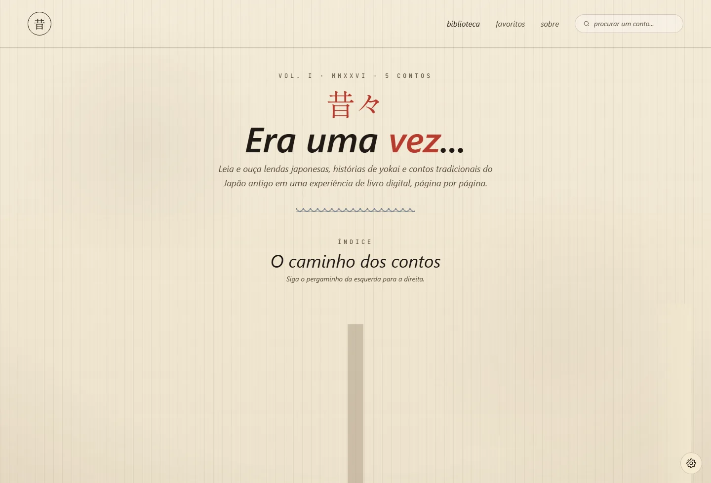
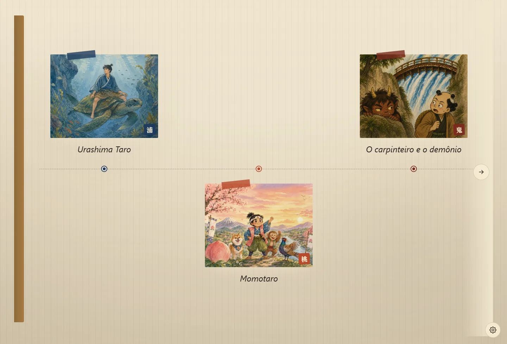
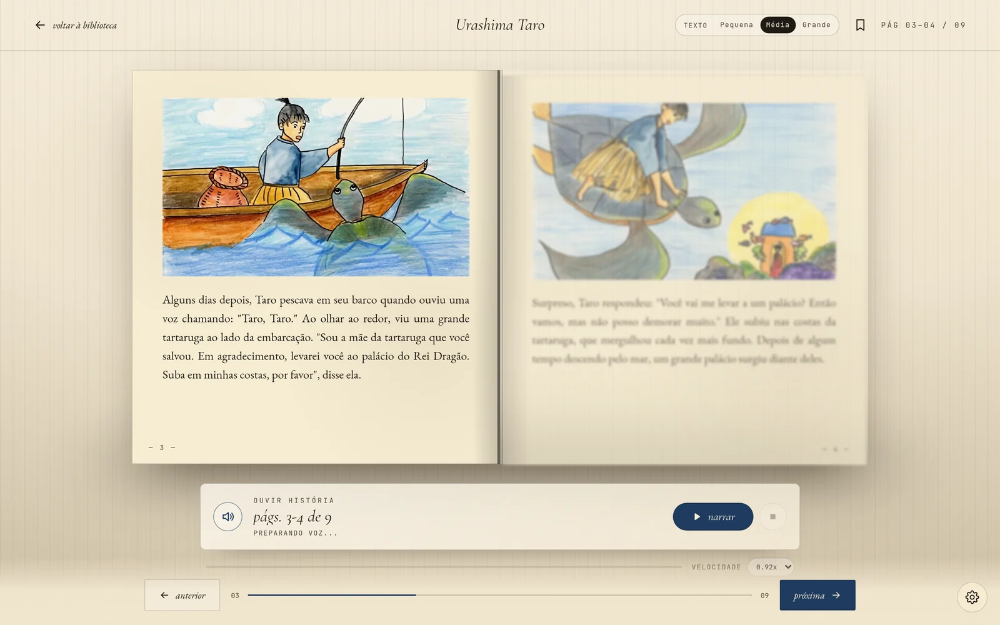
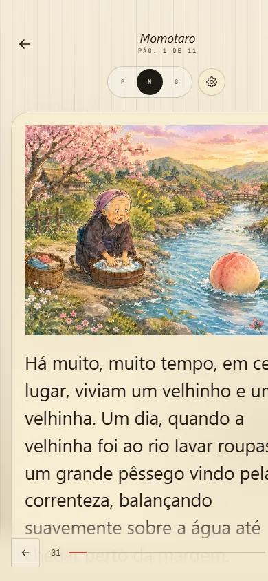

# MukashiMukashi

**Japanese folklore web reader** — illustrated tales read like a real book, page by page.

🌐 **[Live site → mukashi-banashi-two.vercel.app](https://mukashi-banashi-two.vercel.app)**

---

## Screenshots

### Home

### Reader

  

---

## Features

- Book-style reader with page-turn animation, portrait/landscape mode and three font sizes
- Voice narration (Web Speech API) with automatic female-voice selection per language
- 13 languages: Português, English, 日本語, Español, 中文, Italiano, ไทย, Tiếng Việt, Русский, Indonesia, Français, Deutsch, 한국어
- 6 font families (classic, serif, modern, mincho, baloo, merriweather)
- Favorites, search and reading progress persisted locally
- Social sharing (Facebook, WhatsApp, Reddit, link copy)
- Full SEO: meta tags, Open Graph, Twitter Cards, JSON-LD, sitemap.xml, robots.txt
- Dedicated layouts for desktop and mobile

## Stack

| Layer | Technology |
|-------|-----------|
| Framework | Next.js 16 (Pages Router) + React 19 |
| Styling | Tailwind CSS 3 with custom "paper" theme |
| Deploy | Vercel (automatic CI/CD) |
| i18n | Custom geo-detection routing |
| Analytics | Vercel Analytics + Speed Insights |
